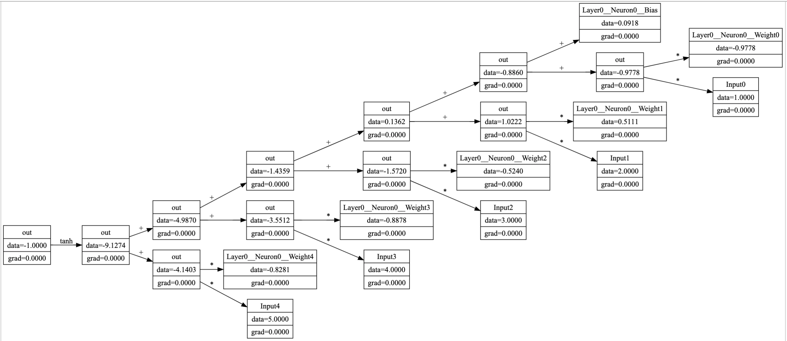

# MicroGrad

## Motivation
Neural net mental model simplified using scalar-valued autograd and a pytorch-like interface

## Usage

```python
from micrograd.core.mlp import MLP

model = MLP(nin=5, nouts=[4])
x = [1.0, 2.0, 3.0, 4.0, 5.0]

y_hat = model(x)
y_hat[0].visualize()
```

This will now visualize the computational graph starting from the output node `y_hat[0]` and working backwards to the input. 

The visualization is done using `graphviz` and `pydot` and will look something like this:



Now we proceed to show how we can compute a loss and backpropagate the gradients to the input `x`:

```python
y = [1, 2, 3, 4, 5]
loss = 1 / 5 * sum([y_hat_i - y_i for y_hat_i, y_i in zip(y_hat, y)])
loss.backward()
print(model.layers[0].neurons[0].w)
```

This will print out the weights of the first neuron in the first layer of the model with the gradients computed using backpropagation:
```
[Value(label=Layer0__Neuron0__Weight0, data=-0.9778159404789095, grad=9.443872728276404e-09), Value(label=Layer0__Neuron0__Weight1, data=0.5110840396200509, grad=1.8887745456552808e-08), Value(label=Layer0__Neuron0__Weight2, data=-0.5240140094344679, grad=2.8331618184829212e-08), Value(label=Layer0__Neuron0__Weight3, data=-0.8877939157413703, grad=3.7775490913105616e-08), Value(label=Layer0__Neuron0__Weight4, data=-0.8280660521974037, grad=4.721936364138202e-08)]
```
